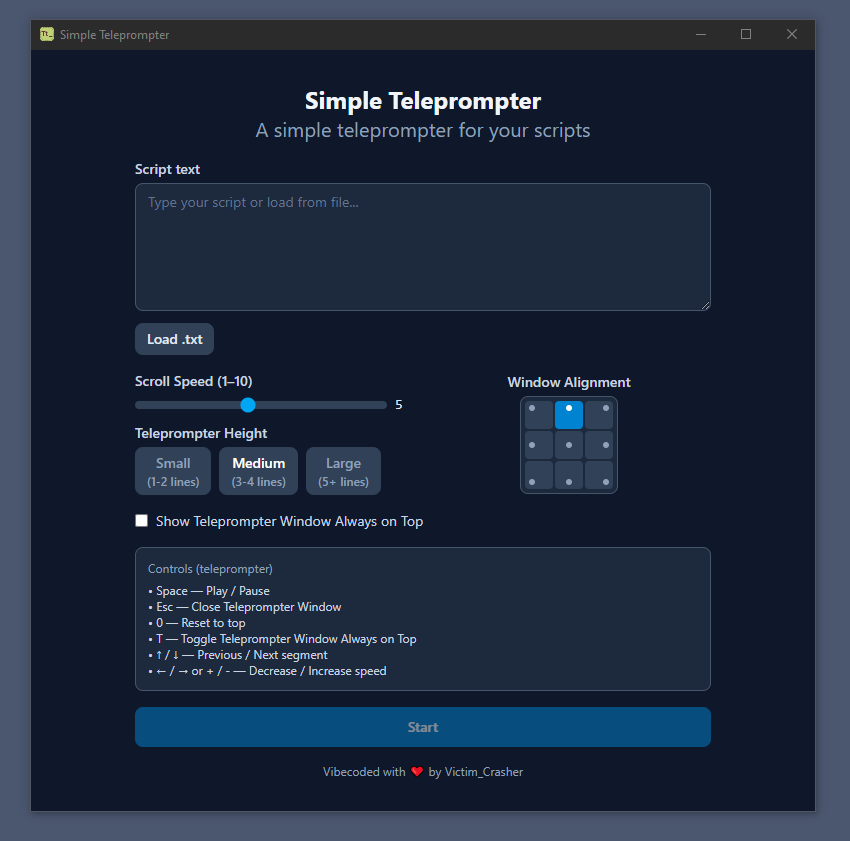
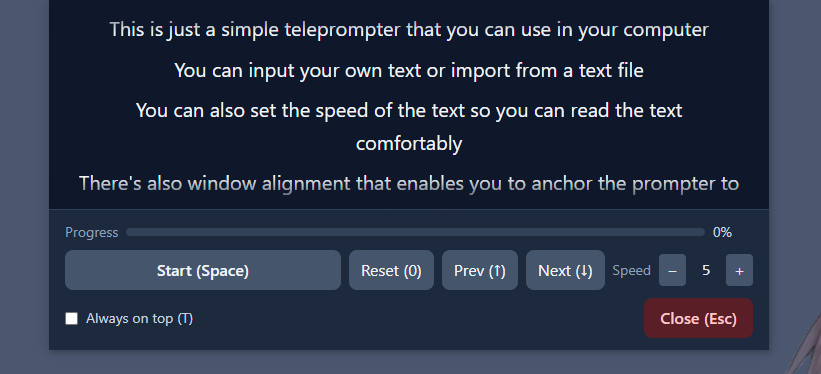

# Simple Teleprompter

  

  

  

A simple teleprompter app, build using Electron + Vite + React  
This app is **vibe coded**  

## Features
- Input your own text or import from any .txt files
- Window Alignment (this is useful to maintain eye contact with your webcam, for example)
- Speed control
- Manual line change
- Always on top window
